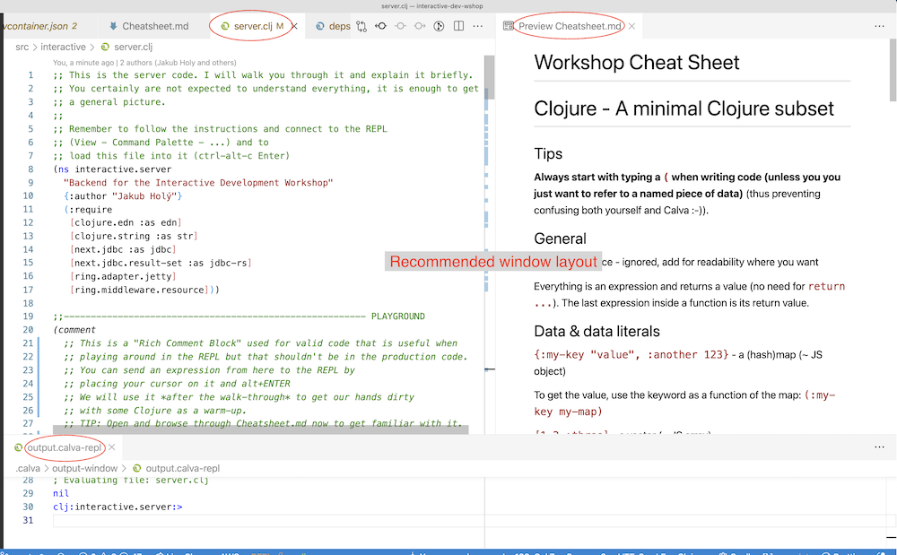

# The "Experience interactive development" workshop

Join us to experience what interactive development (also known as REPL-driven development) is about! Feel the joy of immediate feedback, growing your program in tiny increments, of restart-less development!

Suitable for anyone who has some experience with programming. Having experience with JavaScript is pretty useful (since a few key things there are similar to Clojure, which we will use).

I want to thank Jingyi Li, Maria Vu, and Mathias Årstad Olsen, whose help has made this workshop a whole lot better.

## Instructions

For instructors: Read the [Instructor guide](Instructor%20guide.md).

### Preparation prior to the workshop

Instal Docker (see the [requirements](https://code.visualstudio.com/docs/remote/containers#_system-requirements)), [VS Code](https://code.visualstudio.com/), and its [extension Remote - Containers](https://marketplace.visualstudio.com/items?itemName=ms-vscode-remote.remote-containers)\*.

_\*) Note: Last tested with Calva 2.0.225_

Get a local copy of https://github.com/holyjak/interactive-dev-wshop (`git clone` or [download a zip file](https://github.com/holyjak/interactive-dev-wshop/archive/master.zip))1. 

In VS Code, in the [Command Palette](https://code.visualstudio.com/docs/getstarted/userinterface#_command-palette) (_View - Command Palette..._), search for *Remote-Containers: Open Folder in Container...* and navigate to the downloaded `interactive-dev-wshop` folder. This will open the project in a Docker container with all the dependencies pre-installed. It might take a few minutes.

When finished, run the command (using Command Palette or its hotkey) *Calva: Start a Project REPL and Connect (aka Jack-in)* and

1. In the "Please select a project type" dropdown, select *deps.edn*
2. In the next dropdown, when asked to "Pick an aliases to launch with" _just press OK_ without any alias

A new tab called `output.calva-repl` should open and eventually contain `; Jack-in done.`. After that you are all set up and can close VS Code for now. Repeat the same process just before the workshop (it should go faster then).

You can watch a silent [screencast of me going through the preparations](https://youtu.be/pBKej6KYYCY) (11/2021), which might help you if you run into any troubles. (The screencast goes a little further, to evaluating the code and starting the backend server.)

1) Beware: This directory must be at a place where both VS Code and Docker can see it. That might be an issue under Windows and WSL based on your setup.

Next, read briefly through this file.

### Intro

You are going to experience what "interactive development" is about. The only language build around interactive development that I know is Clojure, so we will use it. You don't need to know it and the goal is not to teach it. I have minimized the amount of Clojure you will need to understand so that we can focus on the interactive development side. (And the code is thus not a good example of a production code.)

Your task is to implement the backend server for a people management service. When the frontend wants data, it POSTs to an endpoint with a list of the fields it wants. You need to deliver the data, from the built-in database - see the description of the tasks below.

The instructor will give you a brief [introduction into Clojure syntax (3 slides)](doc/Clojure%20syntax%20intro%20slides.pdf), will review with you the [Cheatsheet](Cheatsheet.md) for Clojure and key VS Code/Calva shortcuts, and will walk you through the code and provide support and help.

(Tip: When you open the Cheatsheet, run the command "_Markdown: Open Preview_" or [open it in a browser](https://github.com/holyjak/interactive-dev-wshop/blob/master/Cheatsheet.md); it is more readable that way. Have it available, perhaps on a half of the screen, you will need it a lot.)

### Interactive development techniques you will learn:

1. Capture arguments and expensive results as globals (so that you can run sub-expressions from the REPL; mis-uses `def`.)
2. Experiment with small parts of the code (sub-expressions) in the REPL

### Tasks

The tasks are described in more detail in the code. Only briefly:

1. (Guided) Return fake, hard-coded data for people.
2. Replace the hardcoded people data with data from the DB.
3. Find the requested person in the DB, return.
4. Update the person in the DB based on the request.

## At the workshop

### Recommended Calva layout

For me it works best to structure Calva as shown below, i.e. `server.clj` on the left, Markdown preview of the `Cheatsheet.md`, and a tiny `output.calva-repl` on the bottom. (You can drag and drop the tabs where you want them.)

### Running the server

Before you can start coding, you need to start the REPL for evaluating the code and for running the server.

#### Connecting VS Code to the server REPL and starting the server

Make sure that you have opened the project in a _Remote Container_ as described above under *[Preparation prior to the workshop](#preparation-prior-to-the-workshop)*, and follow those instructions also to also start and connect to a REPL (a.k.a. "jack-in").

Load the server code into the REPL - open `server.clj` (_menu - Go - Go to File_) and run _Calva: Load Current File and Dependencies_.
(The line _; Evaluating file: server.clj_ should appear in the _output.calva-repl_ window.)

Now, inside `server.clj`, put your cursor on the line `(-main)` which is nearly at the very end of the file and evaluate it in the REPL via `Alt+ENTER`. This should start the server. The line _Jetty running on: http://localhost:8088/_ should be displayed in the _output.calva-repl_ window. Also, VS Code pops up the following message:

You can click the [Open in Browser] button to show the frontend app or you can manually navigate to [localhost:8088](http://localhost:8088/). You should see the Interactive development workshop webapp.

Finally, go to the beginning of `server.clj` and read the comments.

## Bonus resources

* [Clojure(Script) Syntax in 15 minutes](https://github.com/shaunlebron/ClojureScript-Syntax-in-15-minutes)
